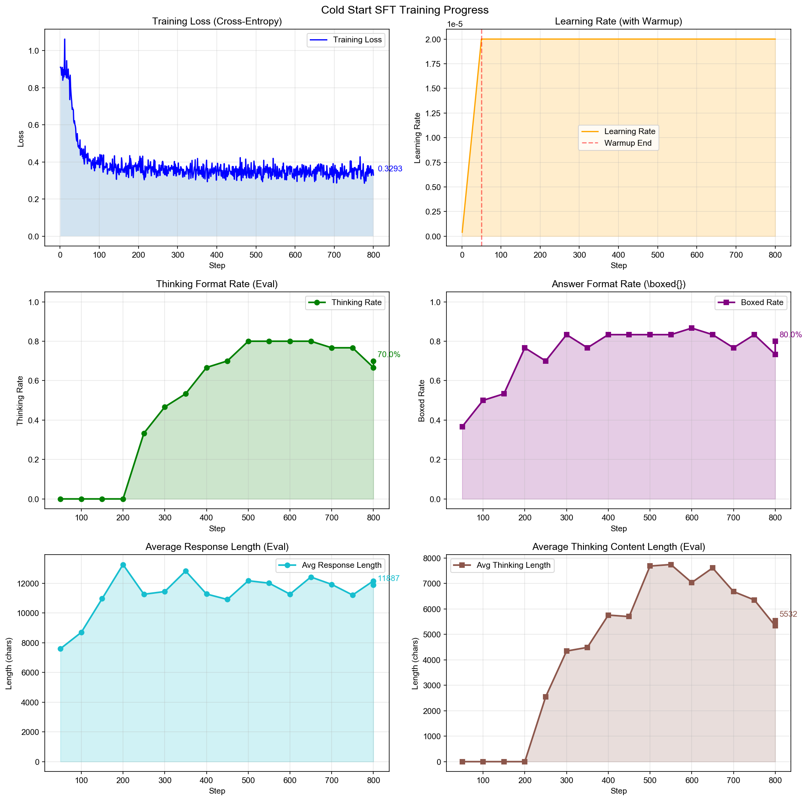
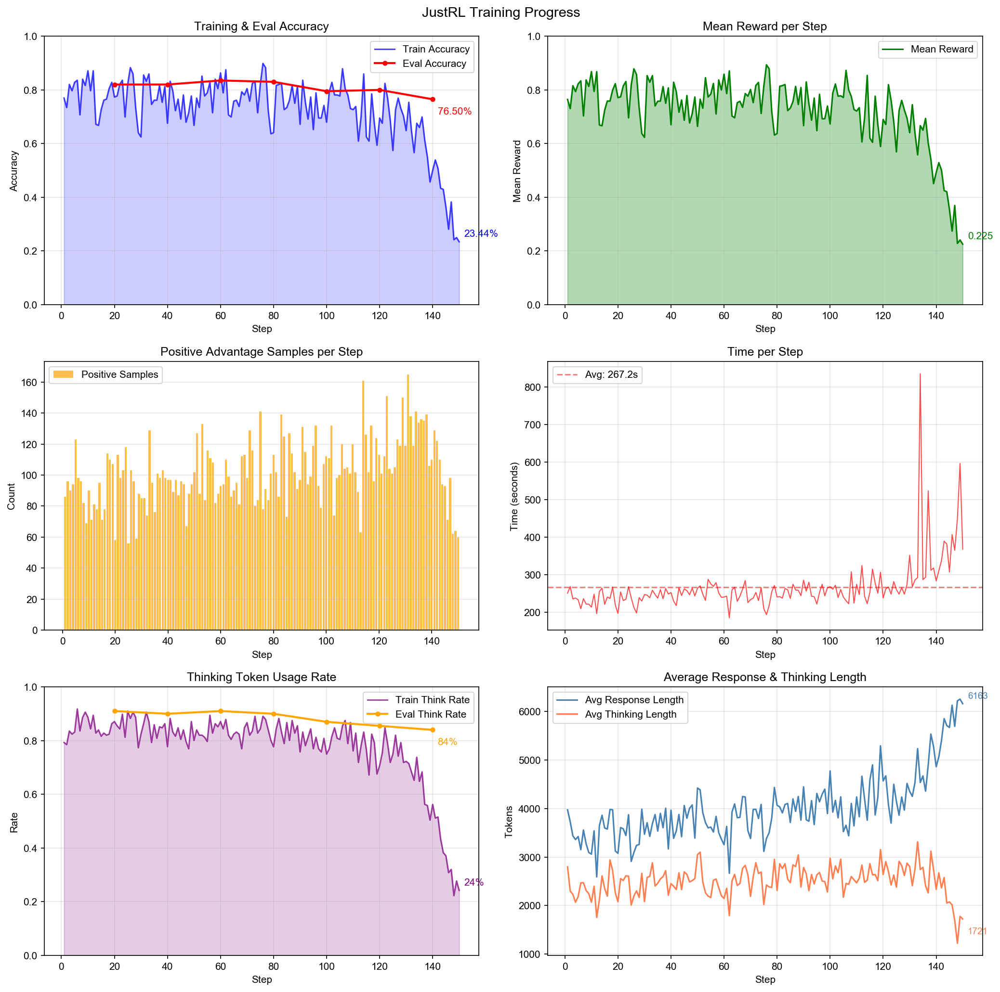
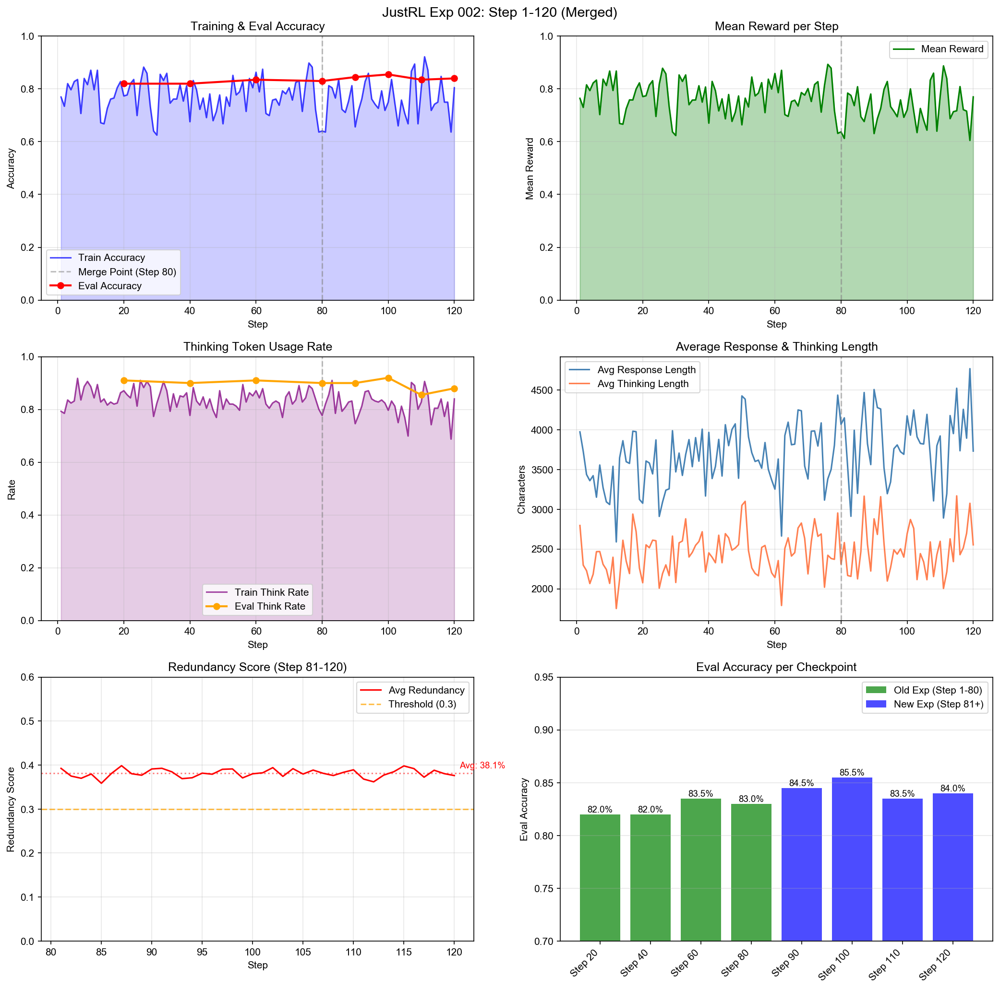
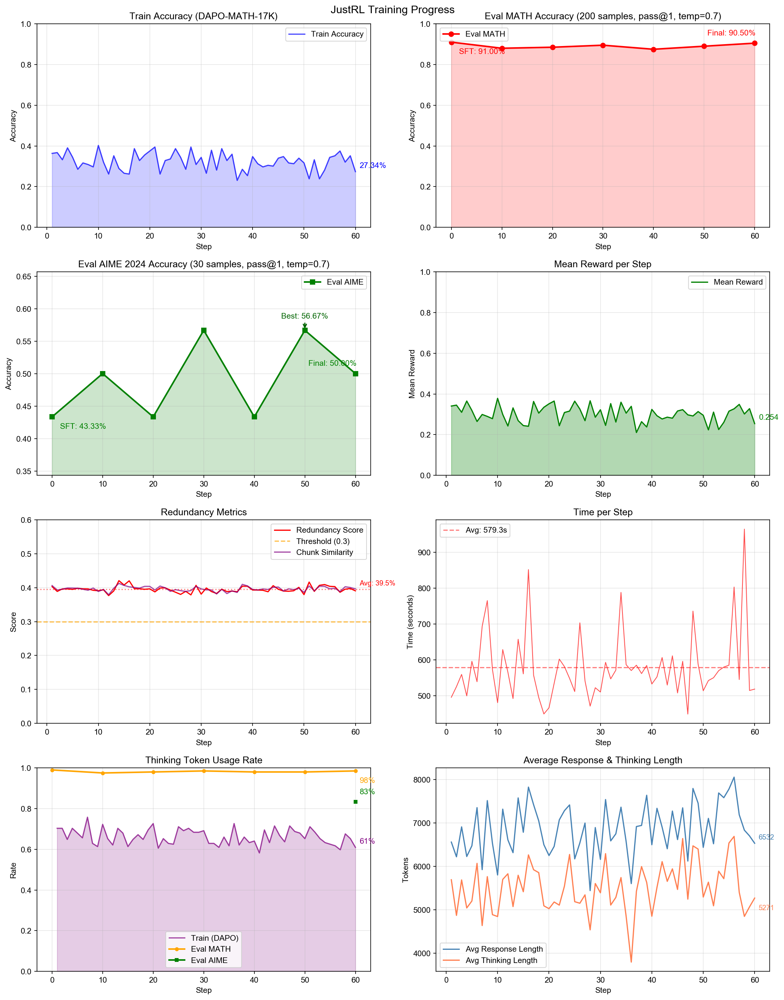

# JustTinker: Minimal Reinforcement Learning with Verifiable Rewards

[](https://opensource.org/licenses/MIT)

[](https://github.com/Guanghan/JustTinker/actions/workflows/lint.yml)

### ✨ Highlights

- 🚀 Full RL training pipeline runnable on your laptop (via Tinker API)
- 📈 **AIME 2024**: 43.3% → 56.7% (+13.3%)
- 🛡️ Novel **redundancy penalty** to prevent reward hacking
- 💰 Total cost: **< $150** (including failed experiments)

**TL;DR**: A minimal implementation of **JustRL**-style reasoning model training using the [Tinker](https://tinker-docs.thinkingmachines.ai/) platform (run it on your Macbook!).

> **JustRL**: Simplicity is all you need. No KL penalty, no entropy regularization, no length penalty—just RL.

## Overview

This repository demonstrates a two-stage training pipeline to transform a standard instruction-tuned model into a reasoning model with explicit thinking capabilities:

| Stage | Purpose |
|-------|---------|
| **Stage 1: Cold-Start SFT** | Teach the model to use `<think>...</think>` tokens |
| **Stage 2: JustRL (GRPO)** | Reinforce reasoning via verifiable rewards |

### Why JustRL?

Based on the paper *"JustRL: Simplicity at Scale"*, we adopt a minimalist approach:

- **No KL penalty** (`kl_coef=0`)
- **No length penalty** (found harmful in experiments)
- **Clip-higher** (`clip_ratio=1.28`)

### Algorithm Evolution: GRPO → JustRL → JustTinker

Our implementation follows the evolution from standard GRPO to the simplified JustRL approach, with our own targeted improvements:

| Feature | Standard GRPO | JustRL | JustTinker (Ours) |
|---------|--------------|--------|-------------------|
| **Rollout** | N responses per problem | Same | rollout_n=8 |
| **Advantage** | Group-relative rewards | Same | Same |
| **Critic Model** | None (Monte Carlo) | Same | Same |
| **KL Penalty** | Yes (kl_coef > 0) | **Removed** | None |
| **Entropy Regularization** | Optional | Removed | None |
| **Clip Ratio** | Symmetric (0.8, 1.2) | **Asymmetric** (0.8, 1.28) | clip-higher |
| **Training Samples** | All samples | **Positive advantage only** | Same |
| **Length Penalty** | Optional | Removed (harmful) | None |

**Our Additional Contributions (JustTinker)**:

| Modification | Source | Purpose |
|-------------|--------|---------|
| `format_reward_weight=0.1` | Added | Encourage `<think>` format |
| **`redundancy_penalty`** | **Original** | Prevent reward hacking via repetitive content |

### Model Choice: Why Qwen3-4B-Instruct-2507?

The original JustRL paper uses [DeepSeek-R1-Distill-Qwen-1.5B](https://huggingface.co/deepseek-ai/DeepSeek-R1-Distill-Qwen-1.5B), which was distilled from DeepSeek-R1 (671B) and **natively outputs `<think>...</think>` format**. This model already "thinks out loud" by default.

In contrast, [Qwen3-4B-Instruct-2507](https://huggingface.co/Qwen/Qwen3-4B-Instruct-2507) is an **internalized reasoning** model:

| Model | Reasoning Style | `<think>` Output |
|-------|-----------------|------------------|
| DeepSeek-R1-Distill-Qwen-1.5B | Explicit (shows reasoning) | Native |
| Qwen3-4B-**Thinking**-2507 | Explicit (shows reasoning) | Native |
| Qwen3-4B-**Instruct**-2507 | Internalized (hidden reasoning) | **No** |

Qwen3-4B-Instruct-2507 was trained to produce concise, direct answers without exposing the step-by-step reasoning process. The reasoning capability is "compressed" into the model weights through distillation, optimizing for fewer output tokens.

**Why use it anyway?** It's the most suitable small model available on Tinker platform. To align with the JustRL setup, we perform a **cold-start SFT** to teach the model the `<think>...</think>` format before RL training.

### Why Cold-Start SFT?

Since Qwen3-4B-Instruct-2507 doesn't output thinking tokens by default, we need to "awaken" this capability:

```
Before SFT: "The answer is 42."
After SFT:  "<think>Let me analyze this step by step...</think>\n\nThe answer is \boxed{42}."
```

This is a very short training phase (~800 steps, <$30) that teaches format compliance, not reasoning ability. The model already has strong reasoning capabilities—we're just teaching it to show its work.

## Stage 1: Cold-Start SFT 

### Configuration

| Parameter | Value |
|-----------|-------|
| Base Model | `Qwen/Qwen3-4B-Instruct-2507` |
| Dataset | OpenR1-Math-220k (10K samples, filtered) |
| Max Sequence Length | 8,192 tokens |
| Training Steps | 800 |
| Batch Size | 16 (8 × 2 gradient accumulation) |
| Learning Rate | 2e-5 |
| **Total Cost** | **< $30** |

### Public Checkpoint

The trained model is made publicly available on Tinker:

```
tinker://b0af3bd0-9638-583f-8c2c-2bb348453023:train:0/weights/coldstart_sft_final
```

You can load this checkpoint directly for Stage 2 (JustRL) training:

```bash
python scripts/tinker/justrl_math_reasoning.py \
    --checkpoint {coldstart_sft_final} \
    --reasoning \
    --scale medium
```

### Training Results

The cold-start SFT successfully taught the model to produce structured thinking:

| Metric                | Initial | Final   |
| --------------------- | ------- | ------- |
| **Thinking Rate**     | 0%      | **70%** |
| **Boxed Answer Rate** | 36.7%   | **80%** |
| Training Loss         | 0.86    | 0.33    |

### Training Curves



<details>
<summary><b>Key Observations</b></summary>

1. **Rapid Format Learning**: The model learned the `<think>` format around step 250-300, with thinking rate jumping from 0% to ~50%

2. **Stable Convergence**: Both thinking rate (~70-80%) and boxed rate (~80%) stabilized after step 500

3. **Response Length Growth**: Average response length increased from ~8K to ~12K tokens as the model learned to produce detailed reasoning

4. **Efficient Training**: 800 steps were sufficient for format learning; further training showed diminishing returns

</details>

### Sample Output

```
Input: How many terms will there be if we expand (4x³ + x⁻³ + 2)²⁰¹⁶?

Output:
<think>
Okay, let's see. I need to figure out how many terms there will be when we
expand (4x³ + x⁻³ + 2)²⁰¹⁶ and combine like terms. Hmm, expanding such a
high exponent might be complicated, but maybe there's a pattern or formula
I can use instead of multiplying everything out.

First, let me recall...
</think>

The number of distinct terms is \boxed{12097}.
```

## Stage 2: JustRL (GRPO)

We conducted three experiments to explore JustRL-style training:

| Experiment | Status | Key Finding |
|------------|--------|-------------|
| **Exp 001** | Failed | Training collapse due to reward hacking |
| **Exp 002** | Partial | Redundancy penalty prevents collapse |
| **Exp 003** | In Progress | AIME accuracy +13.3% with harder data |

### Experiment 001: Training Collapse (Reward Hacking)

> **Experiment ID**: `failed_exp_001_training_collapse_20260111`
> **Status**: Failed — Documented for learning purposes

During our first JustRL training run, we observed a classic **reward hacking** phenomenon where the model exploited the reward function in unintended ways.

#### Configuration Used (Collapsed Experiment)

```yaml
# This configuration led to training collapse
algorithm:
  clip_ratio_low: 0.8
  clip_ratio_high: 1.28
  kl_coef: 0.0              # ❌ No KL penalty - allowed unconstrained drift

training:
  learning_rate: 1e-6
  batch_size: 32
  rollout_n: 8
  max_response_length: 8192

eval:
  eval_interval: 20         # ❌ Too infrequent to catch collapse early
  eval_samples: 200

# - No format reward weight
```

#### Training Curves



The plot shows clear signs of collapse after step ~120: accuracy drops sharply while response length explodes.

#### Timeline

| Step Range | Accuracy | Thinking Rate | Avg Response Length | Status |
|------------|----------|---------------|---------------------|--------|
| 1-50 | 67-88% | 78-92% | 2,600-4,200 | Normal |
| 51-80 | 70-90% | 80-89% | 3,000-4,400 | Normal |
| 80-120 | 60-85% | 72-88% | 3,500-5,000 | Warning signs |
| 120-135 | 55-75% | 65-75% | 4,500-5,200 | Degrading |
| 135-145 | 36-56% | 37-56% | 4,900-5,700 | Rapid collapse |
| 145-158 | 10-28% | 14-31% | 6,000-7,200 | Complete collapse |

#### What Happened?

The model discovered that generating longer responses occasionally led to correct answers by chance. Without constraints, this behavior was reinforced:

```
Feedback Loop:
┌─────────────────────────────────────────────────────────────┐
│  Occasionally long response → correct answer → reward       │
│         ↓                                                   │
│  Policy reinforces "generate longer"                        │
│         ↓                                                   │
│  Quality drops → fewer correct samples                      │
│         ↓                                                   │
│  Remaining correct samples are mostly long → more bias      │
│         ↓                                                   │
│  Collapse: 35,000+ char responses, no reasoning, ~10% acc   │
└─────────────────────────────────────────────────────────────┘
```

#### Sample Analysis

We extracted typical reward hacking samples from Step 140 evaluation:

| Sample | Response Length | Has Thinking | Extracted Answer |
|--------|-----------------|--------------|------------------|
| #1 | 35,739 chars | No | (extraction failed) |
| #2 | 32,268 chars | No | (extraction failed) |
| #3 | 30,484 chars | No | (extraction failed) |
| #4 | 29,964 chars | No | `( ( ( ( ( ( ...` (repetitive) |
| #5 | 29,195 chars | No | (extraction failed) |

**Common patterns**:
- Responses hit max_length (8192 tokens) and get truncated
- No `<think>...</think>` structure
- Repetitive text loops (e.g., "Therefore, the three sides..." repeated 100+ times)
- Self-aware "Wait" statements showing the model recognizes issues but can't stop

> Full analysis: [`docs/research/reward_hacking_mechanism.md`](docs/research/reward_hacking_mechanism.md)

#### Lessons Learned

| JustRL Paper Recommendation | Our Experience |
|----------------------------|----------------|
| `kl_coef=0` | Allowed unconstrained policy drift |
| No length penalty | Contributed to response explosion |
| 800+ steps training | Collapse started at step ~100 |

**Key insight**: JustRL's "simplicity" works for models already trained to reason (DeepSeek-R1-Distill), but may need guardrails for models learning to reason from scratch.

#### Mitigations Implemented

Rather than abandoning JustRL's simplicity, we developed **targeted interventions**:

1. **Format reward**: `format_reward_weight=0.1` to incentivize `<think>` usage
2. **Redundancy penalty** ⭐: Penalize repetitive content (our original contribution)
   - Uses compression ratio + N-gram analysis
   - Only activates when redundancy > 30%
   - Max penalty: 0.3 on correct answers
3. **Early stopping**: Stop if eval accuracy drops 5%+ for 3 consecutive evals
4. **Health monitoring**: Warn if response length > 5000, thinking rate < 60%, or redundancy > 40%

**What we deliberately avoided** (following JustRL):
- ❌ KL penalty
- ❌ Length penalty (found harmful in JustRL experiments)

### Experiment 002: With Redundancy Penalty

> **Experiment ID**: `exp_002_with_redundancy_penalty`
> **Status**: Not fully trained — Step 120/800

After implementing the mitigations above, we resumed training from Step 81 with the new configuration.

#### Configuration

Following JustRL's minimalist philosophy, we avoid KL penalty and length penalty. Instead, we introduce an **original redundancy penalty** to combat reward hacking.

```yaml
algorithm:
  name: grpo
  rollout_n: 8
  clip_ratio_low: 0.8
  clip_ratio_high: 1.28    # clip-higher (JustRL style)
  kl_coef: 0.0             # ❌ No KL penalty (JustRL style)
  entropy_coef: 0.0        # ❌ No entropy regularization

reward:
  type: binary
  correct_reward: 1.0
  incorrect_reward: 0.0
  length_penalty: false           # ❌ No length penalty (harmful per JustRL)
  format_reward_weight: 0.1       # ✅ Encourage <think> token usage
  redundancy_weight: 0.3          # ✅ Original: penalize repetitive content
  redundancy_threshold: 0.3       # ✅ Only penalize when redundancy > 30%

training:
  learning_rate: 1e-6
  max_response_length: 8192
  eval_interval: 10
```

#### Design Philosophy

| Technique | JustRL | Our Approach | Rationale |
|-----------|--------|--------------|-----------|
| KL Penalty | ❌ No | ❌ No | On-policy RL has implicit regularization |
| Length Penalty | ❌ No | ❌ No | Harmful per JustRL findings |
| Format Reward | N/A | ✅ 0.1 | Encourage structured thinking |
| **Redundancy Penalty** | N/A | ✅ **Original** | Combat reward hacking without length penalty |

<details>
<summary><b>Why No KL Penalty?</b></summary>

According to [RL's Razor](https://arxiv.org/abs/2505.23720), on-policy RL training naturally exhibits an **implicit bias** that keeps the policy close to the base model:

> *"On-policy RL training implicitly regularizes KL divergence from the base model, even without explicit KL penalties."*

This theoretical insight, combined with JustRL's empirical success with `kl_coef=0`, supports our decision to skip KL penalty.
</details>

<details>
<summary><b>Redundancy Penalty: Our Original Contribution</b></summary>

Instead of penalizing long responses (which can hurt legitimate reasoning), we penalize **repetitive/redundant content** — the true signature of reward hacking.

**Method**: Dual-metric fusion
1. **Compression ratio** (60% weight): High repetition → high compression → high penalty
2. **N-gram repetition** (40% weight): Repeated 5-grams indicate redundancy

**Validation on reward hacking samples**:

| Sample Type | Redundancy Score | Penalty Applied |
|-------------|------------------|-----------------|
| Normal reasoning | 0-4% | None |
| Reward hacking | 62-89% | 0.14-0.25 |

> Full methodology: [`docs/research/redundancy_penalty_methodology.md`](docs/research/redundancy_penalty_methodology.md)
</details>

#### Training Curves (Step 1-120)



#### Results

| Metric | Step 80 (Before) | Step 120 (Current) | Change |
|--------|------------------|-------------------|--------|
| **Eval Accuracy (MATH)** | 83.00% | 84.00% | +1.0% |
| **Best Eval Accuracy** | 83.50% | **85.50%** (Step 100) | +2.0% |
| **Thinking Rate** | ~80% | ~84% | Stable |
| **Avg Response Length** | ~4000 | ~3700 | Controlled |
| **Avg Redundancy Score** | N/A | ~38% | Within limits |

**Key Observations**:
- No collapse at Step 120 (unlike Exp 001 which collapsed at Step 120-140)
- Redundancy penalty keeping repetitive content in check (~38%, threshold 30%)
- Eval accuracy improved from 83% to 85.5% peak
- Response length stable, not exploding

### Experiment 003: Harder Training & Eval Datasets

> **Experiment ID**: `exp_003_justrl_aligned`
> **Status**: In Progress — Step 60/800

This experiment aligns more closely with the JustRL paper's training setup, using the DAPO-Math-17k dataset and adding AIME 2024 as an additional benchmark.

#### Training Curves (Step 0-60)



#### Current Results

| Metric | SFT Baseline (Step 0) | Step 60 (Current) | Best | Change |
|--------|----------------------|-------------------|------|--------|
| **Eval MATH Accuracy** | 91.00% | 90.50% | 91.00% (Step 0) | -0.5% |
| **Eval AIME Accuracy** | 43.33% | 50.00% | **56.67%** (Step 30/50) | +13.3% |
| **MATH Thinking Rate** | 99% | 98% | — | Stable |
| **AIME Thinking Rate** | 83% | 83% | — | Stable |

**Key Observations**:
- MATH accuracy remains stable around 88-91% (no degradation)
- **AIME accuracy improved significantly**: 43.33% → 56.67% peak (+13.3%)
- Thinking rate stable on both benchmarks
- No reward hacking observed (redundancy score ~39%, within limits)

#### Configuration

Same reward/algorithm setup as Experiment 002, with key changes:

| Parameter | Exp 002 | Exp 003 | Note |
|-----------|---------|---------|------|
| **Training Dataset** | MATH train (~7.5K) | **DAPO-Math-17k** (11.4K) | Harder problems |
| **Eval Datasets** | MATH only | **MATH + AIME-2024** | Added competition benchmark |
| **Max Response Length** | 8,192 tokens | **15,360 tokens** | Aligned with JustRL paper |

#### Dataset Details

| Dataset | Source | Size | Purpose |
|---------|--------|------|---------|
| **DAPO-Math-17k** | `BytedTsinghua-SIA/DAPO-Math-17k` | 11,384 | Training (RL) |
| **MATH-test** | `HuggingFaceH4/MATH-500` | 200 (stratified) | Evaluation |
| **AIME-2024** | `HuggingFaceH4/aime_2024` | 30 | Evaluation (competition-level) |

#### Key Differences from Experiment 002

| Aspect | Exp 002 | Exp 003 |
|--------|---------|---------|
| Training Data | MATH train | **DAPO-Math-17k** |
| Eval Benchmarks | MATH only | **MATH + AIME** |
| Max Response | 8,192 tokens | **15,360 tokens** |
| Training Samples | ~7,500 | ~11,384 |

#### Artifacts
```
tinker://fbadbbce-0cfc-53dd-ad26-9117748c5070:train:0/weights/checkpoint_step_50
```

## Project Structure

```
RLVR/
├── README.md                    # This file
├── scripts/
│   ├── launchers/               # Shell scripts (run_coldstart_sft.sh, run_justrl_reasoning.sh)
│   ├── tinker/                  # Tinker API scripts (coldstart_sft.py, justrl_math_reasoning.py)
│   └── utils/                   # Utilities (plot_rlvr_training.py, plot_sft_training.py)
├── src/
│   ├── configs/                 # Training configurations (SFTConfig, RLConfig)
│   ├── data/                    # Dataset loading (MATH, GSM8K, DAPO-Math-17k, AIME)
│   ├── evaluation/              # Math verification (MathVerifier)
│   └── prompts/                 # Prompt formatting utilities
└── resources/                   # Training curves and artifacts
    ├── coldstartSFT/            # Stage 1 results
    ├── justRL_exp001/           # Exp 001 (collapsed)
    ├── justRL_exp002/           # Exp 002 (with redundancy penalty)
    └── justRL_exp003/           # Exp 003 (DAPO + AIME)
```

## Quick Start

### Prerequisites

```bash
# Install dependencies
pip install -r requirements.txt

# Set API key
export TINKER_API_KEY=your_api_key
```

### Run Cold-Start SFT

```bash
./scripts/launchers/run_coldstart_sft.sh small
```

### Run JustRL Training

```bash
# Exp 003:
./scripts/launchers/run_justrl_reasoning.sh medium --reasoning \
      --checkpoint tinker://b0af3bd0-9638-583f-8c2c-2bb348453023:train:0/weights/coldstart_sft_final
```

## Cost Analysis

> **Credits**: All experiments were conducted using **$150 free credits** gifted by [Tinker](https://tinker-docs.thinkingmachines.ai/).

| Stage | Steps | Estimated | Actual |
|-------|-------|-----------|--------|
| Cold-Start SFT | 800 | ~$46 | **< $30** |
| JustRL Exp 001 + 002 | 160 (120+40) | ~$100 | **$72** |
| JustRL Exp 003 | 60 | ~$48 | **$34**  |
| **Total Spent** | — | — | **~$136** |
| **Remaining Credit** | — | — | **~$14** |

**JustRL Cost Breakdown**:
- Exp 001 (collapsed): ~120 steps before reward hacking
- Exp 002 (with redundancy penalty): 40 steps (Step 81-120)
- Average cost: **~$0.45/step**

> **Note**: Costs are based on Tinker pricing for Qwen3-4B-Instruct-2507 ($0.22/M tokens). Actual costs are often lower than estimates due to early stopping and response length variance.

## References

### Papers

- [JustRL: Simplicity at Scale](https://arxiv.org/abs/2512.16649) — Core methodology
- [DeepSeek-R1 Technical Report](https://github.com/deepseek-ai/DeepSeek-R1) — GRPO algorithm
- [DAPO: Decoupled Clip and Dynamic Sampling](https://arxiv.org/abs/2503.14476) — Advanced techniques
- [RL's Razor: On-Policy Implicit Regularization](https://arxiv.org/abs/2505.23720) — Why KL penalty may be unnecessary

### Frameworks

- [Tinker Platform](https://tinker-docs.thinkingmachines.ai/) — Training infrastructure


## License

MIT License


## Citation

If you find this repository helpful, please cite:

```bibtex
@misc{ning2026justtinker,
  author       = {Ning, Guanghan},
  title        = {JustTinker: Minimal Reinforcement Learning with Verifiable Rewards},
  year         = {2026},
  publisher    = {GitHub},
  url          = {https://github.com/Guanghan/JustTinker},
  note         = {A minimal implementation of JustRL-style reasoning model training with redundancy penalty}
}
```
